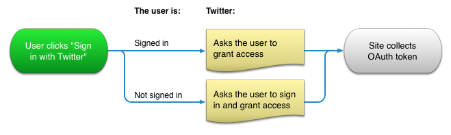

# PoliSee

Empowers citizens by connecting issues they care about with the representatives who vote on them. Built with React and Rails by @mikey4XU, @d0ntg0m0ng, @posthumus4, @emiliocorprus, @pborel.

## Oauth - Twitter
### 3-legged authorization
The 3-legged OAuth flow allows your application to obtain an access token by redirecting a user to Twitter and having them authorize your application. This flow is almost identical to the flow described in Implementing Sign in with Twitter, with two exceptions:

The GET oauth/authorize endpoint is used instead of GET oauth/authenticate
The user will always be prompted to authorize access to your application, even if access was previously granted.
The possible states for the 3-legged sign in interaction are illustrated in the following flowchart:

